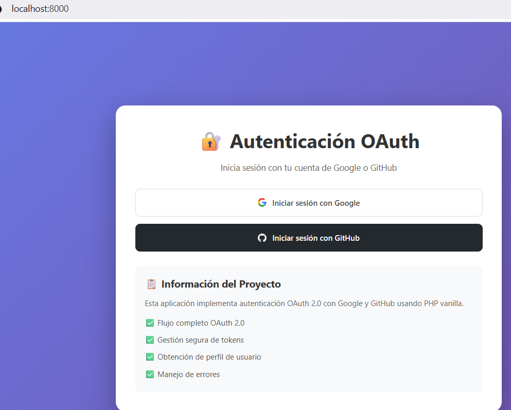

[](https://classroom.github.com/a/owUFZwxD)

# 🔐 Aplicación Web con PHP Vanilla - Autenticación OAuth 2.0

Aplicación web desarrollada en PHP vanilla que implementa el sistema de autenticación OAuth 2.0 de Google y GitHub, permitiendo a los usuarios iniciar sesión con sus cuentas de estos proveedores.

## 📋 Características Implementadas

✅ **Flujo completo de autenticación OAuth 2.0** con Google y GitHub  
✅ **Gestión segura de tokens** de acceso y sesiones  
✅ **Obtención de información del perfil** del usuario autenticado  
✅ **Manejo de errores** y validaciones  
✅ **Variables de entorno** para credenciales sensibles  
✅ **Interfaz moderna** y responsive  
✅ **Protección CSRF** en el flujo de GitHub OAuth

## 🛠️ Requisitos Técnicos

- **PHP 7.4 o superior**
- **Composer** (gestor de dependencias de PHP)
- **Servidor web** (Apache, Nginx, o el servidor integrado de PHP)
- **Credenciales OAuth** de Google Cloud Console y GitHub

## 📁 Estructura del Proyecto

```
proyecto/
├── config/
│   └── config.php              # Configuración general y carga de .env
├── src/
│   ├── GoogleOAuth.php         # Clase para autenticación con Google
│   └── GitHubOAuth.php         # Clase para autenticación con GitHub
├── public/
│   └── style.css               # Estilos CSS
├── index.php                   # Página principal de login
├── login.php                   # Inicia el flujo OAuth
├── callback.php                # Callback para recibir respuesta OAuth
├── dashboard.php               # Panel de usuario autenticado
├── logout.php                  # Cierra la sesión
├── composer.json               # Dependencias del proyecto
├── .env.example                # Template de variables de entorno
└── .gitignore                  # Archivos a ignorar en Git
```

## 🚀 Instalación y Configuración

### 1. Clonar el repositorio

```bash
git clone <url-del-repositorio>
cd <nombre-del-proyecto>
```

### 2. Instalar dependencias con Composer

```bash
composer install
```

### 3. Configurar variables de entorno

Copia el archivo `.env.example` a `.env`:

```bash
copy .env.example .env
```

Edita el archivo `.env` con tus credenciales:

```env
# Configuración de Google OAuth
GOOGLE_CLIENT_ID=tu_client_id_de_google
GOOGLE_CLIENT_SECRET=tu_client_secret_de_google
GOOGLE_REDIRECT_URI=http://localhost:8000/callback.php?provider=google

# Configuración de GitHub OAuth
GITHUB_CLIENT_ID=tu_client_id_de_github
GITHUB_CLIENT_SECRET=tu_client_secret_de_github
GITHUB_REDIRECT_URI=http://localhost:8000/callback.php?provider=github

# Configuración de la aplicación
APP_URL=http://localhost:8000
SESSION_SECRET=cambia_esto_por_una_cadena_aleatoria
```

### 4. Obtener credenciales OAuth

#### Para Google:

1. Ve a [Google Cloud Console](https://console.cloud.google.com/)
2. Crea un nuevo proyecto o selecciona uno existente
3. Habilita la **Google+ API**
4. Ve a **Credenciales** → **Crear credenciales** → **ID de cliente de OAuth**
5. Tipo: **Aplicación web**
6. URI de redireccionamiento autorizado: `http://localhost:8000/callback.php?provider=google`
7. Copia el **Client ID** y **Client Secret** al archivo `.env`

#### Para GitHub:

1. Ve a [GitHub Settings](https://github.com/settings/developers)
2. Click en **OAuth Apps** → **New OAuth App**
3. Rellena:
   - Application name: Tu nombre de aplicación
   - Homepage URL: `http://localhost:8000`
   - Authorization callback URL: `http://localhost:8000/callback.php?provider=github`
4. Copia el **Client ID** y genera un **Client Secret**
5. Copia ambos valores al archivo `.env`

### 5. Iniciar el servidor

Usa el servidor integrado de PHP:

```bash
php -S localhost:8000
```

### 6. Acceder a la aplicación

Abre tu navegador y ve a: `http://localhost:8000`

## � Capturas de Pantalla

### Funcionamiento en Local



*La aplicación funcionando en el entorno local con el servidor PHP integrado en el puerto 8000*

## �💡 Uso de la Aplicación

1. **Página Principal**: Verás dos botones para iniciar sesión con Google o GitHub
2. **Selecciona un proveedor**: Click en el botón del proveedor que prefieras
3. **Autoriza la aplicación**: Serás redirigido al proveedor para autorizar el acceso
4. **Dashboard**: Después de autorizar, verás tu información de perfil
5. **Cerrar sesión**: Click en el botón "Cerrar Sesión" para salir

## 🔒 Seguridad Implementada

- ✅ Variables de entorno para credenciales sensibles (no se suben a Git)
- ✅ Validación de estado (state) en GitHub OAuth para prevenir ataques CSRF
- ✅ Validación de tokens de acceso
- ✅ Gestión segura de sesiones PHP
- ✅ Sanitización de salidas HTML con `htmlspecialchars()`
- ✅ Manejo de errores y excepciones

## 📦 Dependencias

- **google/apiclient**: ^2.15 - Cliente de Google API para PHP
- **guzzlehttp/guzzle**: ^7.8 - Cliente HTTP para peticiones a la API de GitHub

## 🧪 Flujo de Autenticación OAuth 2.0

### Google:
1. Usuario click en "Iniciar sesión con Google"
2. Redirigir a Google para autorización
3. Usuario autoriza la aplicación
4. Google redirige con código de autorización
5. Aplicación intercambia código por token de acceso
6. Obtener información del perfil del usuario
7. Guardar en sesión y redirigir al dashboard

### GitHub:
1. Usuario click en "Iniciar sesión con GitHub"
2. Redirigir a GitHub con state aleatorio (protección CSRF)
3. Usuario autoriza la aplicación
4. GitHub redirige con código y state
5. Validar state recibido
6. Intercambiar código por token de acceso
7. Obtener información del perfil y email del usuario
8. Guardar en sesión y redirigir al dashboard

## 🎨 Características de la Interfaz

- 🎨 Diseño moderno y atractivo con gradientes
- 📱 Responsive (se adapta a móviles y tablets)
- 🖼️ Muestra foto de perfil del usuario
- 📊 Visualización de datos del usuario en grid
- 🔍 Ver datos JSON completos del usuario
- ⏱️ Muestra duración de la sesión
- 🎯 Badges para identificar el proveedor OAuth

## 🐛 Solución de Problemas

### Error: "El archivo .env no existe"
- Asegúrate de copiar `.env.example` a `.env` y configurar las credenciales

### Error: "Class 'Google_Client' not found"
- Ejecuta `composer install` para instalar las dependencias

### Error de redirección OAuth
- Verifica que las URIs de redirección en `.env` coincidan con las configuradas en Google/GitHub
- Asegúrate de usar el mismo puerto (8000)

### La sesión no persiste
- Verifica que PHP tenga permisos de escritura en el directorio de sesiones

## 📝 Notas de Desarrollo

- El proyecto usa PHP vanilla (sin frameworks) según los requisitos
- Las clases OAuth están en el namespace `App\`
- Se implementa PSR-4 autoloading con Composer
- El código incluye comentarios y documentación PHPDoc

## 👤 Autor

Diego QB - Proyecto de Autenticación OAuth con PHP Vanilla

## 📄 Licencia

Este proyecto es de código abierto y está disponible para fines educativos.
